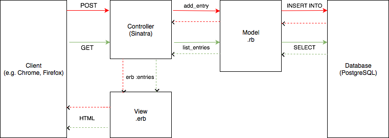

# Daily Diary Application!

This is a mini project completed independently. Users will be able to add, edit, and delete diary entries with a title and body. This full-stack project will use Sinatra and Ruby for front end and model, and PostgreSQL for the back end database.

## Domain model diagram

Here is a diagram I sketched to represent the domain model for this project: including representations of the client, controller, model, database, and view. This diagram shows examples of two functions for the diary app: listing entries, and adding a new entry.

### How to use the app
In terminal:
- Run `bundle init`.
- Install `postgres` if you haven't already, then connect to `psql`.

For development:
- Enter the following command to create the `daily_diary` database: `CREATE DATABASE daily_diary;`.
- Connect to this database using `\c daily_diary;`.
- Enter the command found in `./db/migrations/01_create_diary_table.sql`.

For testing:
- Enter the following command to create the `daily_diary_test` database: `CREATE DATABASE daily_diary_test;`.
- Connect to this database using `\c daily_diary_test;`.
- Enter the command found in `./db/migrations/01_create_diary_table.sql`.
